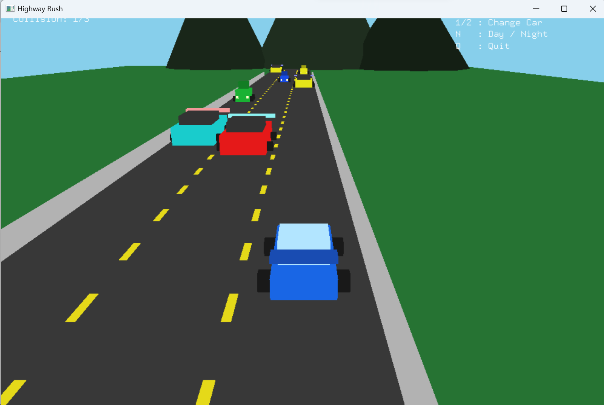

# 🏎️ Highway Rush

A fast-paced highway racing game built with **Python** and **OpenGL**.


---

## 🎮 About the Project

**Highway Rush** is a simple 2D/3D racing-style game where the player drives on a highway and avoids obstacles.  
The game is made using Python and OpenGL graphics.

This project was created as part of my CSE423 coursework.

---

## ✨ Features

- 🚗 Player-controlled car movement
- 🛣️ Highway-style gameplay
- 🚧 Obstacle avoidance
- 🎯 Score-based gameplay
- 🎨 OpenGL-based graphics
- ⚡ Smooth and simple controls

---

## 🛠️ Technologies Used

- Python
- PyOpenGL
- OpenGL
- VS Code

---

## 📁 Project Structure

```text
HighwayRush/
│
├── HighwayRush.py
└── README.md

▶️ How to Run the Project

First, make sure Python is installed on your computer.

Then install the required packages:

pip install PyOpenGL PyOpenGL_accelerate

Run the game:

python HighwayRush.py
🎮 Controls
Key	Action
Left Arrow	Move Left
Right Arrow	Move Right
Up Arrow	Move Forward
Down Arrow	Move Backward
Esc	Exit Game

📸 Screenshot


👩‍💻 Author

Shimla

GitHub: @shimla50

⭐ Support

If you like this project, please give it a star on GitHub.